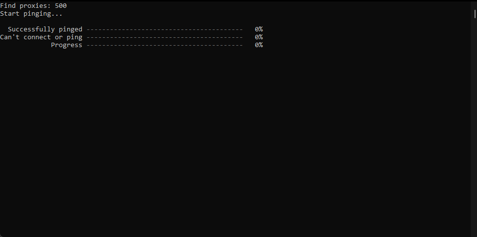

Socks Pinger
=====================

**If application doesn't run look at the error.log file.**

## Preconditions
- [Install .NET CORE 3.1 RUNTIME](https://dotnet.microsoft.com/download/dotnet/3.1)
- [Install Microsoft Visual C++ Redistributable](https://docs.microsoft.com/en-us/cpp/windows/latest-supported-vc-redist?view=msvc-160)

## Settings
Create settings.json in the folder with .exe file.
Spys.One config:
```
string { "serviceAddress": "https://spys.one/en/socks-proxy-list/" }
string { "executedJsOnStart": "document.getElementById('xpp').value = '5'; document.querySelector(`form[method='post']`).submit()" }
string { "matchRegex": "(?<=<font class=\"spy14\">)[\\d]*\\.[\\d]*\\.[\\d]*\\.[\\d]*|(?<=<font class=\"spy2\">:</font>)[\\d]*" }
int { "matchesCount": 1000 }
string { "pingAddress": "www.google.com:80" }
string { "outputPath": "proxies.txt" }
int { "timeoutMs": 3000 }
bool { "isCacheRequests": true }
```

## Screenshots



## Environment (only windows x64)
- WPF C# 9.0 using .NET CORE 3.1
- [CefSharp](https://github.com/cefsharp/CefSharp)
- [SpectreConsole](https://spectreconsole.net)

## About
Socks Pinger is developing under the [MIT license](LICENSE).
